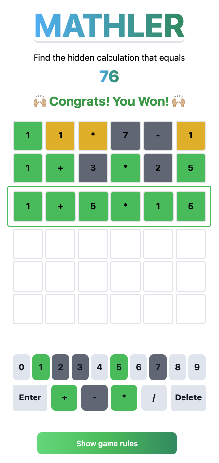

# Mathler

Mather is inspired by the game Wordle. But it is with numbers. The user has 6 guesses to try and find the equation that equals a number. The number changes every day. (e.g Find the hidden calculation that equals 12)

## Technology and Tools

- React + Typescript
- Tailwind
- Vitest
- [pnpm](https://pnpm.io/)

## Get started

```sh
pnpm install
```

```sh
pnpm start
```

Go to [http://localhost:3000/](http://localhost:3000/)

```sh
pnpm test
```

```sh
pnpm coverage
```

## Screenshot


