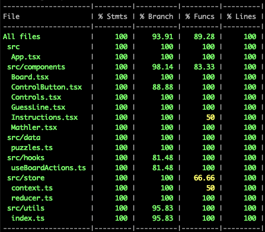

# Mathler

Mather is inspired by the game Wordle. But it is with numbers. The user has 6 guesses to try and find the equation that equals a number. The number changes every day. (e.g Find the hidden calculation that equals 12)

## Technology and Tools

- React + Typescript
- Tailwind
- Vitest + React Testing Library

## Get started

```sh
pnpm install
```

```sh
pnpm start
```

Go to [http://localhost:3000/](http://localhost:3000/)

```sh
pnpm test
```

```sh
pnpm coverage
```

## Notes

The game is fully functional and is meeting all the requirements:

- Numbers and operators can appear multiple times.
- Order of operation applies (\* and / are calculated before + and -)
- The color of the tiles should change to reflect the status (green / yellow / grey)
- Should accept commutative solutions (e.g. 1+5\*15 === 15\*5+1)
- UX: Controlling the game should be done with the mouse and keyboard
- All game states are functional -- win, loss, partial outcomes, wrong answers, and commutative solutions

UI:

- Dynamic animations added on different game actions
- Fully responsive

Testing

- The unit test are covering 100% of code lines (see screenshot below), this show my commitment to reliability and high-quality software development.
- Using the latest Vitest + testing-library/react
-

Bonus

- Make sure you have the sound on when you're winning! 🔊

## Screenshot


## Code Coverage


